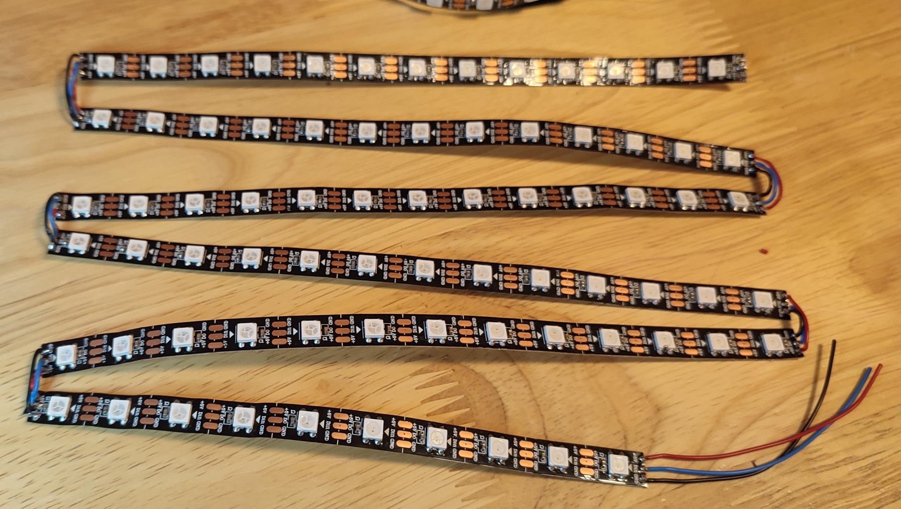
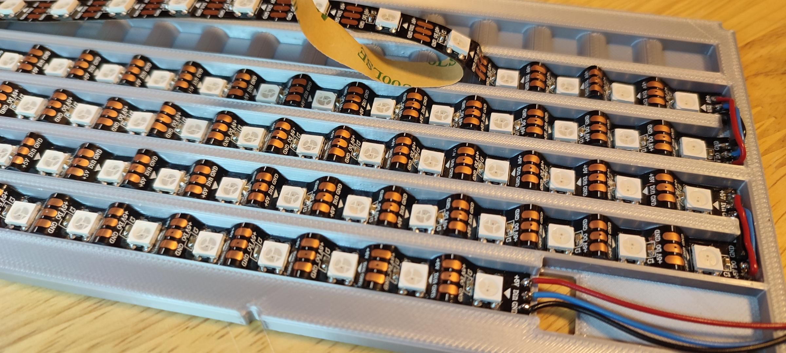
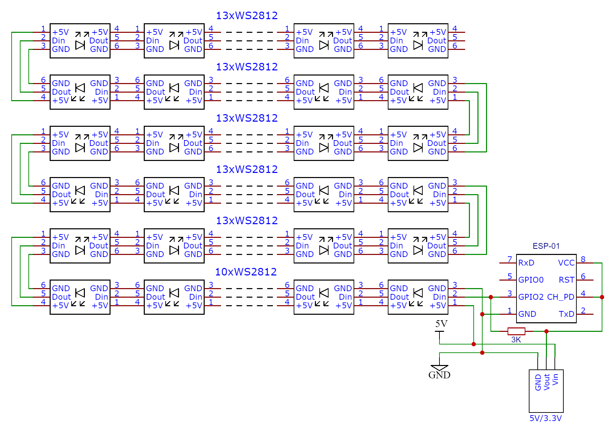
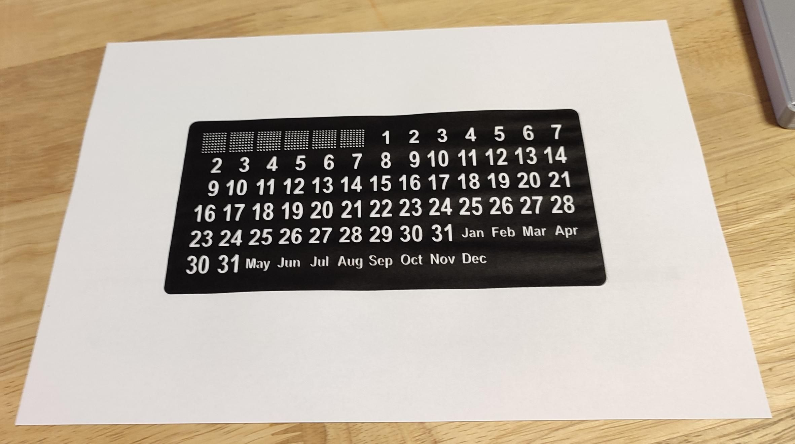
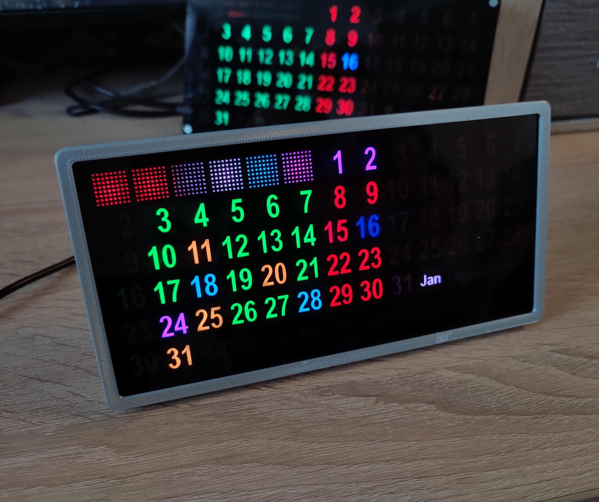

# Guía de Ensamblaje y Cableado

[](ASSEMBLY.en.md)
[](ASSEMBLY.md)

Pasos para montar el hardware del Calendario Perpetuo, desde el corte de las tiras LED hasta el ensamblaje final.

> Antes de empezar, revisa la [Lista de Materiales](BILL_OF_MATERIALS.md). Para la guía completa con todas las imágenes, ver la [Guía Completa](https://xe1e.github.io/Perpetual-Calendar-with-Google-Calendar-Connection-V2/GUIA_COMPLETA.html).

---

## Paso 1 — Cortar las Tiras LED

Corta la tira de LEDs WS2811/WS2812B (60 LEDs/m) en **6 piezas**:

- **5 piezas** de 13 LEDs cada una
- **1 pieza** de 10 LEDs

Total: 75 LEDs.



> ⚠️ **Dirección de los datos:** Fíjate en las flechas impresas en la tira. Las piezas se conectan en **zigzag**, alternando la dirección en cada fila.

---

## Paso 2 — Montar los LEDs en el Soporte

1. Coloca las tiras de LEDs en el soporte impreso en 3D, entre los relieves.
2. Presiona firmemente con un palo de plástico para una buena adherencia.
3. Los relieves acercan los LEDs a **~12 mm** de distancia (densidad efectiva similar a 83 LEDs/m).
4. Respeta la dirección de las flechas: cada fila va en sentido contrario a la anterior (zigzag).



### Orden lógico de los LEDs (mapeo)

El firmware espera los 75 LEDs en este orden de cableado en zigzag:

```
Fila 1 (LEDs 68-74): izquierda → derecha
Fila 2 (LEDs 61-49): derecha  → izquierda
Fila 3 (LEDs 36-48): izquierda → derecha
Fila 4 (LEDs 35-23): derecha  → izquierda
Fila 5 (LEDs 10-22): izquierda → derecha
Fila 6 (LEDs  9-0 ): derecha  → izquierda

LEDs 62-67: reloj HH:MM:SS (solo versión Color Coded Clock)
```

> El detalle completo del mapeo está en el [Manual Técnico](MANUAL.md#mapeo-de-leds).

---

## Paso 3 — Cableado y Conexiones



### Conexiones principales

| ESP8266 | Tira LED WS2811 | Notas |
|---------|-----------------|-------|
| GPIO2 (D4) | DIN (Data In) | A través de la **resistencia de 3 kΩ** hacia VCC |
| GND | GND | GND común con la fuente |
| — | VCC (+5V) | Desde la **fuente externa** de 5V/3A |
| VIN / 5V | — | Alimentación del ESP desde los 5V (o regulador) |

### Reglas de cableado

```
        Fuente 5V / 3A
         │        │
       (+5V)    (GND)
         │        │
         ├────────┼──────────► Tira LED (VCC / GND)
         │        │
         ▼        ▼
       ESP8266   ESP8266
       (5V/VIN)  (GND)  ◄── GND COMÚN obligatorio

   GPIO2 (D4) ──[ 3 kΩ ]── VCC
       │
       └──────────► DIN de la tira LED
```

> 🔴 **Resistencia de 3 kΩ (obligatoria):** Va entre GPIO2 y VCC. Sin ella, el ESP8266 puede no arrancar con la tira conectada.

> 🔴 **No alimentes los LEDs desde el ESP.** 75 LEDs pueden consumir varios amperios. Usa la fuente externa de 5V/3A y une **todos los GND** (fuente + LEDs + ESP).

---

## Paso 4 — Preparar el Papel con los Números

Imprime la plantilla [`docs/plantilla_numeros.pdf`](docs/plantilla_numeros.pdf) en papel A4 (blanco). Contiene los números de los días y los nombres de los meses. Recorta siguiendo el contorno.



---

## Paso 5 — Ensamblaje Final

El conjunto se arma en capas, de atrás hacia adelante:

1. **Soporte con LEDs** — base con las tiras montadas y soldadas.
2. **Módulo ESP + regulador** — fijados con pegamento caliente en la ranura.
3. **Rejilla 3D** — sobre el soporte; separa la luz de cada LED.
4. **Papel impreso** — con los números hacia arriba.
5. **Acrílico ahumado** — difunde la luz y protege.
6. **Marco frontal** — fija todo en su lugar.
7. **Pata trasera** — con cinta adhesiva de espuma.



> 💡 **Rejilla del reloj:** Si vas a usar el firmware *Color Coded Clock*, usa la versión de rejilla **con** separaciones para los 6 LEDs del reloj (62–67).

---

## Siguiente Paso

Con el hardware montado, instala el firmware y configura el dispositivo:

- 📥 [Instalación del firmware (Web Flasher)](README.md#instalación-rápida-web-flasher)
- ⚙️ [Configuración inicial y de red](MANUAL.md#instalación-y-configuración-inicial)
- 📅 [Configuración de Google Calendar](GOOGLE_CALENDAR_SETUP.md)

---

## Problemas Comunes de Hardware

| Síntoma | Posible causa | Solución |
|---------|---------------|----------|
| Los LEDs no encienden | Datos/alimentación/resistencia | Verifica GPIO2, los 5V, la resistencia de 3 kΩ y la dirección de las flechas. Usa "Test LEDs" en `/led.html` |
| El ESP no inicia o se reinicia | Falta resistencia de 3 kΩ o fuente insuficiente | Añade la resistencia; usa una fuente de 5V/**3A** mínimo; une los GND |
| Colores o brillo erráticos | GND no común / cable de datos largo | Une todos los GND; acorta el cable de datos a DIN |
| Parte de los LEDs no responde | Corte o soldadura en zigzag invertida | Revisa la dirección de las flechas en cada fila |

---

*Guía de ensamblaje del proyecto Perpetual Calendar with Google Calendar Connection v2.2*
